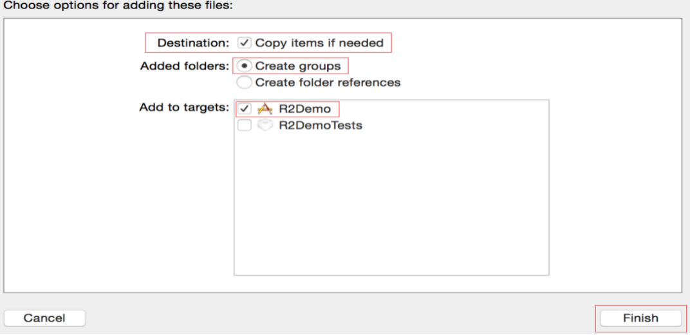

# 1.开发环境搭建

请将R2SDK、Facebook、Google、Twitter相关的SDK以copy items方式拖入您的Xcode工程目录中。具体框架如下：

* R2SDKFramework.framework
* R2SDK.bundle
* R2SDKUI.framework
* R2SDKUIBundle.bundle
* R2FacebookFramework.framework
* FBSDKShareKit.framework
* FBSDKLoginKit.framework
* FBSDKCoreKit.framework
* R2GoogleFramework.framework
* R2GoogleBundle.bundle
* GoogleSignInDependencies.framework
* GoogleSignIn.framework
* GoogleSignIn.bundle
* R2TwitterFramework.framework
* TwitterKitResources.bundle
* TwitterCore.framework
* TwitterKit.framework

