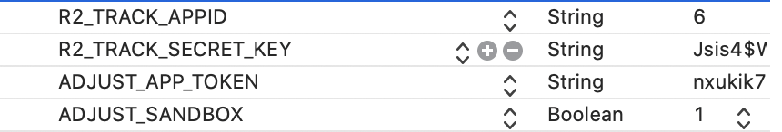

# 15.1 集成配置

1、如需要使用SDK内部集成的Firebase打点功能，则请完成“2.4 Firebase Analytics集成”。并且在info.plist文件中，添加R2\_FIREBASE\_TRACK，并且设置为YES,表示进行Firebase打点，否则为NO。

2、如需要使用SDK内部集成的Adjust打点功能,请完成“2.3 Adjust配置”，并且引入头文件\#import&lt;AdjustSdk/Adjust.h&gt;。并且在info.plist文件中，增加ADJUST\_APP\_TOKEN、ADJUST\_SANDBOX参数。ADJUST\_APP\_TOKEN为Adjust参数，具体不详，可以咨询SDK技术人员。ADJUST\_SANDBOX是沙盒模式的标记，调试阶段请设为YES,否则请设为NO。

3、请在Info.plist文件中增加打点app id和secret key。请增加R2\_TRACK\_APPID、R2\_TRACK\_SECRET\_KEY参数，具体值若不详请咨询SDK服务器端技术人员。

如图所示：

