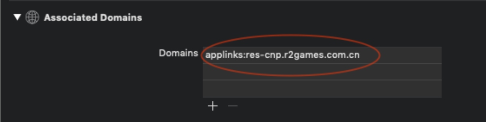
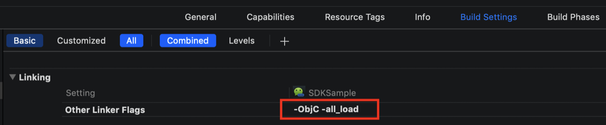
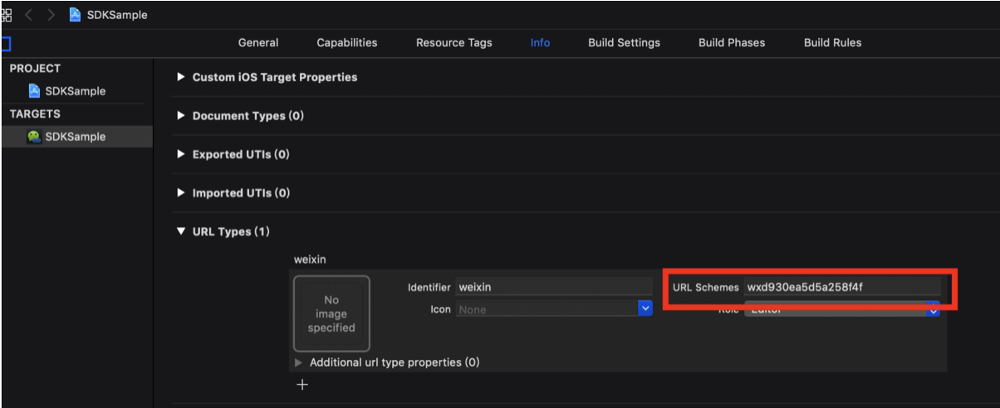
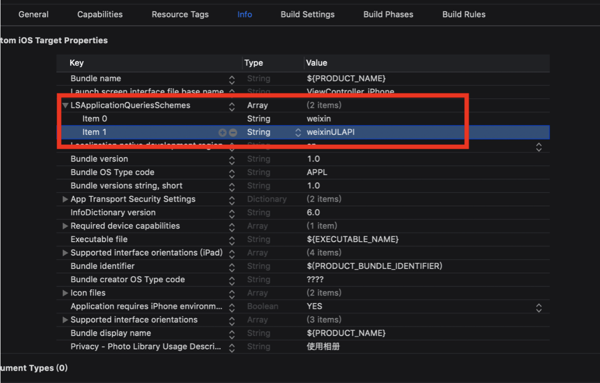
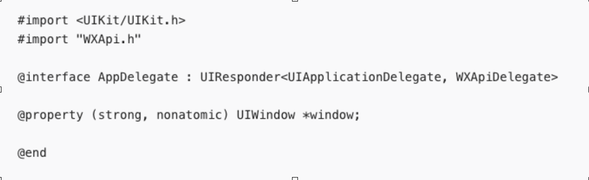

# 2.1微信配置

#### 1、配置应用的Universal Links

 在工程中打开Associated Domains开关，将Universal Links域名加到配置上。如无特殊需求，则填写 applinks:res-cnp.r2games.com.cn 并且可以在浏览器输入[https://res-cnp.r2games.com.cn来验证universal](https://res-cnp.r2games.com.cn来验证universal) link是否配置成功。如果在浏览器最顶部提示，在“xxxxx”应用中打开，则表示配置成功。否则配置失败，请检查该项配置。若不详，请联系SDK技术人员。



#### 2、集成微信SDK

 将如下 libWeChatSDK.a，WXApi.h，WXApiObject.h WechatAuthSDK.h 四个文件添加到工程中。按照1.1的添加方式。


3、在工程中链接上:Security.framework, CoreGraphics.framework, WebKit.framework。

 4、在你的工程文件中选择 Build Setting，在"Other Linker Flags"中加入"-ObjC -all\_load”



5、在 Xcode 中，选择你的工程设置项，选中“TARGETS”一栏，在“info”标签栏的“URL type“添加“URL scheme”为你所注册的应用程序AppID（如下图所示）。



6、在Xcode中，选择你的工程设置项，选中“TARGETS”一栏，在 “info”标签栏的“LSApplicationQueriesSchemes“添加weixin 和weixinULAPI（如下图所示）。



7、配置AppDelegate文件 在你需要使用微信终端 API 的文件中 import WXApi.h 头文件，并增加 WXApiDelegate 协议。



\[1\] 要使你的程序启动后微信终端能响应你的程序，必须在代码中向微信终端注册你的 id。（如下所示，在 AppDelegate 的 didFinishLaunchingWithOptions 函数中向微信注册 id）。请将WXAPP\_ID和WXUNIVERSAL\_LINK替换成您的应用的具体参数，不详请咨询SDK技术人员。

```objectivec
- (BOOL)application:(UIApplication *)application didFinishLaunchingWithOptions:(NSDictionary *)launchOptions {
    [WXApi registerApp:WXAPP_ID universalLink:WXUNIVERSAL_LINK];
    return YES;
}
```

\[2\] 重写 AppDelegate 的openURL 方法：

```objectivec
-(BOOL)application:(UIApplication *)app openURL:(NSURL *)url options:(NSDictionary<UIApplicationOpenURLOptionsKey,id> *)options{

    [WXApi handleOpenURL:url delegate:[RNWechatHelper sharedInstance]];
    return YES;
}
```

\[3\] 重写AppDelegate的continueUserActivity方法：

```objectivec
-(BOOL)application:(UIApplication *)application continueUserActivity:(NSUserActivity *)userActivity restorationHandler:(void (^)(NSArray<id<UIUserActivityRestoring>> * _Nullable))restorationHandler{

    return [WXApi handleOpenUniversalLink:userActivity delegate:[RNWechatHelper sharedInstance]];
}
```

