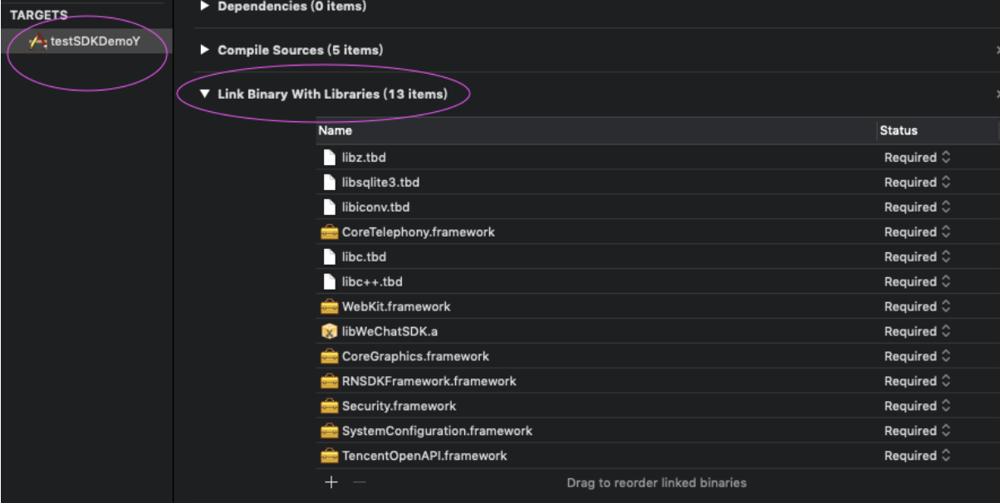
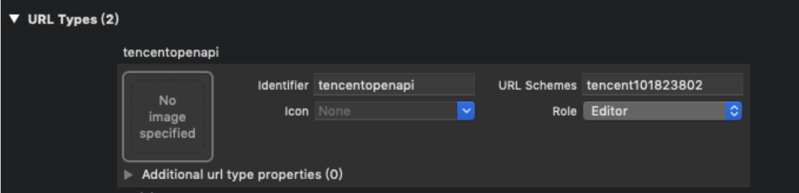
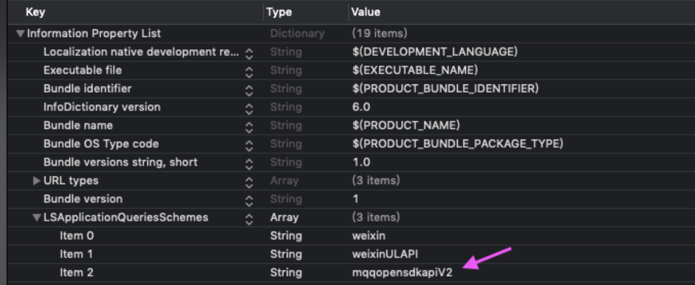

# 2.2 QQ配置

1、集成QQ SDK

 将TencentOpenAPI.framework文件按照1.1集成方式，集成到应用开发的目录下。

2、添加SDK依赖的系统库文件

 分别是“Security.framework”、“SystemConfiguration.framework”、 “CoreGraphics.Framework”、“CoreTelephony.framework”、“libiconv.tbd”，“libsqlite3.tbd”、“libz.tbd”、“libc.tbd”、“libc++.tbd”。如下所示：




3、在你的工程文件中选择 Build Setting，在"Other Linker Flags"中加入"-fobjc-arc”。

4、在 Xcode 中，选择你的工程设置项，选中“TARGETS”一栏，在“info”标签栏的“URL type“添加“URL scheme”为你所注册的应用程序 id（如下图所示）。scheme = tencent + appid, scheme的前缀为tencent，请将appid修改为您的appid.



5、在Xcode中，选择你的工程设置项，选中“TARGETS”一栏，在 “info”标签栏的“LSApplicationQueriesSchemes“添加mqqopensdkapiV2（如下图所示）。



6、配置AppDelegate文件 在需要使用的文件中，先引入头文件\#import &lt;TencentOpenAPI/TencentOAuth.h&gt;

\[1\] 初始化，application:didFinishLaunchingWithOptions:方法中注册QQ APPID参数。请将QQAPPID替换成您的应用的具体参数，不详请咨询SDK技术人员。

```objectivec
- (BOOL)application:(UIApplication *)application didFinishLaunchingWithOptions:(NSDictionary *)launchOptions {
    [[RNQQHelper sharedInstance]setAppId:QQAPPID];
    return YES;
}
```

\[2\] 重写AppDelegate 的openURL方法。

```objectivec
-(BOOL)application:(UIApplication *)app openURL:(NSURL *)url options:(NSDictionary<UIApplicationOpenURLOptionsKey,id> *)options{
    if ([TencentOAuth CanHandleOpenURL:url] == YES) {
        [TencentOAuth HandleOpenURL:url];
    }
    return YES;
}
```

\[3\] 重写AppDelegate的continueUserActivity方法.

```objectivec
-(BOOL)application:(UIApplication *)application continueUserActivity:(NSUserActivity *)userActivity restorationHandler:(void (^)(NSArray<id<UIUserActivityRestoring>> * _Nullable))restorationHandler{
     NSURL *url = userActivity.webpageURL;
     if(url && [TencentOAuth CanHandleUniversalLink:url]) {
         return [TencentOAuth HandleUniversalLink:url];
     }
 return YES;
}
```

