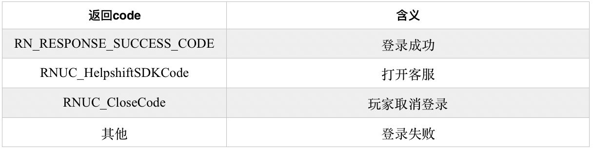

# 3.1.3 账号登录接口\(必须接入\)

#### 功能说明：

 研发方在完成上面的配置后，调用此登录接口，首次可以调起账号登录界面。如果玩家首次登录成功后，下次用户将使用静默登录方式，不再弹出账号登录界面。SDK登录成功后返回用户的唯一标识uid，游戏研发方需利用接口返回的数据用于向游戏服务器做登录验证。

#### 接口形式：

```objectivec
-(void)doLoginFromViewController:(UIViewController*)viewController
               completionHandler:(RNLoginHandler)handler;
```

#### 接口参数：

 viewController：当前视图控制器，必须。

 handler：回调，必须。包含三个参数code,msg,result。 其中isNew字段可以判断是否新用户，isGuest判断是否纯游客（既没有绑定电话号码，也没有绑定QQ或微信）。isVerified字段判断是否已进行实名信息认证。verifySwitch字段为YES,表示开启实名验证相关功能。注意必须先判断verifySwitch的值，再决定是否开启实名验证相关功能。

#### 接口回调code说明：




注: 1\)客户端登录成功\(即接口回调 code 为 RN\_RESPONSE\_SUCCESS\_CODE\)后，研发需要将 uid, time, sign 回传到研发服务器进 行数据验证，具体的验证方法可以查看 SDK 服务器对接文档; 

2\)当接口回调 code 为 RNUC\_HelpshiftSDKCode时，表明玩家在登录界面上触发了打开客服系统的操作，此时研 发方需要调用客服Helpshift API 来向玩家展示客服界面。


#### 接口示例：

```objectivec
[[RNSDKApi sharedInstance]doLoginFromViewController:self completionHandler:^(int code, NSString *msg, RNLoginResponse *result) {
               //登录成功，研发方需取得uid,time,sign等参数进行服务器端验证操作
                 if (code == RN_RESPONSE_SUCCESS_CODE) {
                       NSLog(@"login successful ,msg-> %@",msg);
                       //取得帐号的 uid，便于游戏自身定位玩家
                       NSString *userId = result.uid;
                       //isNew = YES ，表示新用户
                       BOOL isNew =result.isNew;
                   //isGuest = YES ，表示纯游客，既没有绑定电话号码，也没有绑定QQ或微信
                       BOOL isGuest =result.isGuest;
                //isVerified = YES ，表示已经实名验证
                       BOOL isVerified= result.isVerified;
                   //verifySwitch = YES ，表示开启实名验证相关功能，否则无需开启。
                        BOOL verifySwitch =result.verifySwitch;
                       //取得相关验证登录合法性的数据,用于向游戏服务器做登录验证
                       NSString *loginTimestamp = result.time;
                       NSString *sign = result.vsign;
                       NSLog(@"send [uid=%@,timestamp=%@,sign=%@] to        server for the  verification",userId,loginTimestamp,sign);
                        }
             
                     //玩家点击了客服入口，此时需要调起Helpshift SDK
                      else if(code == RNUC_HelpshiftSDKCode){
          
                              //需要将msg的值传入客服预填充接口的metadata中
                              //具体请参考客服Helpshift SDK相关接口
                         
                      }
        
                    //玩家点击关闭页面，获取取消登录
                     else if(code == RNUC_CloseCode){
                          }
                      //其他，登录失败
                        else{
                       NSLog(@"login failed,msg-> %@,code -> %d",msg,code);
                       }
       }];
```

