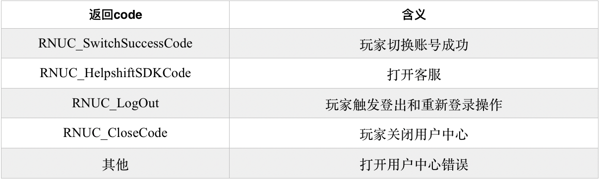

# 3.1.4 用户管理中心接口\(必须接入\)

#### 功能说明：

 研发方在用户完成登录后，调用用户管理中心接口，会弹出用户管理中心的界面，里面包含账号管理、联系客服等功能。游戏需要关注该接口返回的三个code码的处理。改接口的调用时机可以选择在游戏选服界面或者游戏内的用户设置界面，需要设计一个按钮，提供给玩家进行触发操作。

#### 接口形式：

```objectivec
-(void)launchUserCenterViewController:(UIViewController*)viewController uid:(NSString*)uid roleId:(NSString*)roleid serverId:(NSString*)serverid completionHandler:(RNUserCenterHandler)handler;
```

#### 接口参数：

 viewController：当前视图控制器，必须。

 uid：当前玩家登陆账号的r2uid （必须，登录接口获取）。

 roleId：当前玩家游戏角色ID标识符，\(可选,若可获取则必传\)。

 serverId：服务器唯一标识符，\(可选,若可获取则必传\)。

 callback: 回调，必须。

#### 接口回调code说明：




1\)如果玩家切换游戏账号成功\(即 code 为 RNUC\_SwitchSuccessCode\)，研发需要将 uid,time,sign 回传到研发服务器进行登录数据验证，并正确切换到新的游戏账号; 

2\)当接口回调 code 为 RNUC\_HelpshiftSDKCode时，表明玩家在用户中心界面上触发了打开客服系统的事件，此时研发需要调用相关客服Helpshift SDK 的接口来向玩家展示客服界面。

3\)当接口回调 code 为 RNUC\_LogOut时，表明玩家在用户中心触发账号登出和重新登录操作,此时游戏研发方需要登出当前游戏账号，回到游戏开始登录的界面.


#### 接口示例：

```objectivec
[[RNSDKApi sharedInstance]launchUserCenterViewController:self uid:self.r2uid roleId:@"roleid" serverId:@"50000" completionHandler:^(int code, NSString *msg, id result) {
        
                  //切换账号成功，需要向游戏服务器做登录验证
                 if (code == RNUC_SwitchSuccessCode) {
                   //取得相关验证登录合法性的数据,用于向游戏服务器做登录验证,切换游戏账号
                       RNLoginResponse *resul = (RNLoginResponse*)result;
                       NSString *uid = resul.uid;
                        NSString *loginTimestamp = resul.time;
                        NSString *sign = resul.vsign;
                    
                        }
        
                        //玩家点击了客服入口，此时需要调起Helpshift SDK
                        else if(code == RNUC_HelpshiftSDKCode){
                         
                                //需要将msg的值传入客服预填充接口的metadata中
                                //具体请参考客服Helpshift SDK相关接口
                            
                        }
        
                        //玩家触发登出和重新登录操作
                        else if (code == RNUC_LogOut){
                           //游戏研发方需要登出当前游戏账号，回到游戏开始登录的界面
                            //需要重新调起登录接口
                        }
        
                         //玩家关闭用户中心页面
                        else if (code == RNUC_CloseCode){
                           
                        }
                        
                        //其他情况，若无其他特殊情况研发方无需处理
                        else{
                           
                        }
    }];
```

