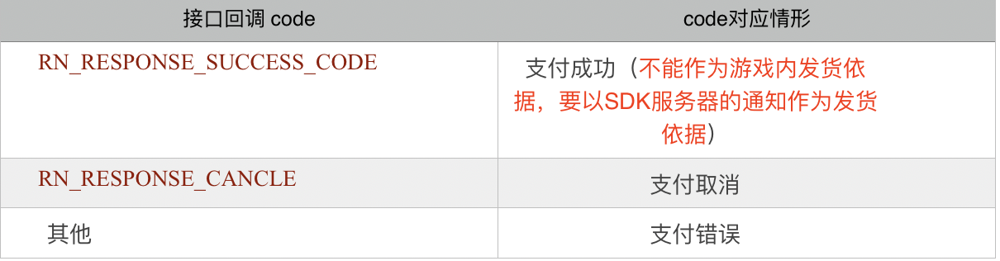

# 3.2.3 支付接口（必须接入）

#### 功能说明：

研发方可以直接调用该接口来让玩家完成产品的支付。支付包括苹果支付以及第三方支付。切换的逻辑由SDK方运营后台控制。一般为提审时为苹果支付，提审成功后是否切换第三方支付，由游戏以及SDK方运营共同决定。研发只用调用该接口即可，具体的业务逻辑SDK内部会处理。研发不要通过该接口的回调成功与否来作为游戏内发货的依据，而要以SDK支付服务器的通知作为是否发货的依据。

#### 接口形式：

```objectivec
-(void)payWithRequester:(RNPayRequester *)requester
         completionHandler:(RNPayNowCompletionHandler)handler;
```

#### 接口参数：

 requester:请求创建的对象，研发设置其属性传入，详见下图示例 

requester中的属性详解：

 viewcontroller：当前活动的UIViewController （必须）

 productid：苹果itunesconnect应用管理后台上定义的支付产品ID （必须）

 uid：当前玩家UID （必须，登录接口返回的UID）（必须）

 roleid : 当前玩家游戏内的角色id \(必须\)

 rolename : 当前玩家游戏内的角色名称（必须）

 rolelevel:当前玩家在游戏内的等级（必须）

 serverid : 当前玩家所处服务器唯一标示ID \(必须\) 

enable:是否允许第三方支付,默认YES \(必须\) 

gamecno：游戏服分配的支付订单号（必须）

 isvertica： 是否是竖直屏幕，应用为横屏时为NO,应用为竖屏时为YES \(必须\) 

productname：产品名称 \(可选\)

money：当前支付产品对应的人民币价格（可选）

 extradata:支付可自定义额外数据,属于透传数据（可选）

 usingLoadingView: 支付过程中是否需要显示加载框（可选）

 handler：接口回调（必须）



#### 接口示例：

```objectivec
RNPayRequester *requester = [[RNPayRequester alloc]init];
    requester.viewcontroller = self;
    requester.productid = @"163";
    requester.productname = @"diamos";
    requester.money = @"0.99";
    requester.uid = @"65";
    requester.roleid = @"roleid";
    requester.rolename = @"guanyu";
    requester.rolelevel = @"13";
    requester.serverid = @"008";
    requester.gamecno = @"no00988";
    requester.extradata = @"extradata";
    requester.enable = NO;
    requester.isvertica = YES;
    requester.usingLoadingView = YES;

[[RNSDKApi sharedInstance]payWithRequester:requester completionHandler:^(int code, NSString *msg, NSDictionary *info) {
      if (code == RN_RESPONSE_SUCCESS_CODE) {
            //支付成功
            NSString *cno = [info objectForKey:@"cno"];// SDK方生成的订单号
            // 支付的类型，苹果支付为 “applepay” ，微信支付为"spH5"，支付宝支付为"apH5"
            NSString *paytype = [info objectForKey:@"paytype"];
        }else if (code == RN_RESPONSE_CANCLE){
            //pay cancel
            NSLog(@"user cancel");
        }else{
            //pay error
            NSString *error = msg;
        }    
  }];
```

