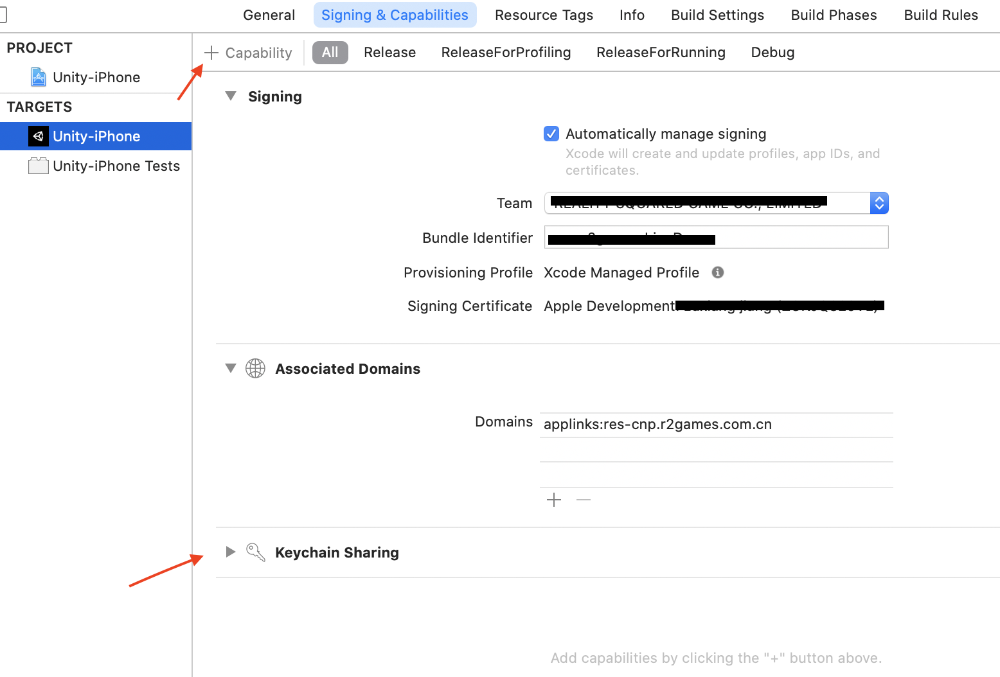

# 10.1 集成配置

1、请将LineSDK.framework、R2LineFramework.framework、LineSDKResource.bundle以copy items if needed方式拖进你的Xcode项目工程主目录，具体选择请参照“1.1添加R2SDKFramework.framework”。

2、配置项目Info.plist

（1）请在info.plist中添加line白名单。key为LSApplicationQueriesSchemes ， value为lineauth2。如下图1所示：


（2）请按如下图所示，注册Url scheme. 值为line3rdp.$\(PRODUCT\_BUNDLE\_IDENTIFIER\)。请将$\(PRODUCT\_BUNDLE\_IDENTIFIER\)替换成您游戏的包名bundle identifier。


3、配置通用链接universal link 请按如图所示配置applinks:res-cnp.r2games.com.cn


4、选择Target项目，打开Keychain Sharing功能。如下图所示：



5、请将info.plist以source code格式打开，增加如下键值对，注意请将“1234567890”替换成您自己的应用的channel id参数。

```objectivec
<key>LineSDKConfig</key>
<dict>
    <key>ChannelID</key>
    <string>1234567890</string>
</dict>
```

6、请确保Link Binary With Libraries里链接了LineSDK.framework 、CoreTelephony.framework、Security.framework。

