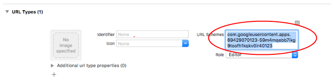

# 8.1集成配置

1\) 添加库

请研发方向其游戏xcode工程中添加如下代码库和资源库：

 GoogleSignIn.framework 

GoogleSignInDependencies.framework 

GoogleSignIn.bundle

 R2GoogleFramework.framework 

R2GoogleBundle.bundle 

请研发方在其xcode工程项目中链接如下系统Framework:

 LocalAuthentication.framework 

SafariServices.framework

SystemConfiguration.framework

 AuthenticationServices.framework

2）配置AppDelegate 请研发在游戏工程的AppDelegate中相应的方法里添加如下配置代码：

```objectivec
- (BOOL)application:(UIApplication *)application didFinishLaunchingWithOptions:(NSDictionary *)launchOptions {        
NSString *googleClientId = @"9825068096-ama8dc07lj0vp7bo052l5muv142a2qas.apps.googleusercontent.com";     
[[R2GoogleHelper sharedInstance] initWithGoogleSignInClientId:googleClientId];                    
return YES;}
注： googleClientId对应的值，请向游戏运营人员获取

- (BOOL)application:(UIApplication *)application openURL:(NSURL *)url options:(NSDictionary<UIApplicationOpenURLOptionsKey,id> *)options {    
 return [[R2GoogleHelper sharedInstance]
handleURL:url   
sourceApplication:options[UIApplicationOpenURLOptionsSourceApplicationKey]                      
      annotation:options[UIApplicationOpenURLOptionsAnnotationKey]]; 
}
```

3）添加URL SCHEME 研发方需要向其项目工程中添加一个自定义的URL SCHEME,如下图所示：



其对应的值为googleClientId的倒序， 比如 googleClientId为 123456.apps.googleusercontent.com,则该处需要配置的url scheme为 com.googleusercontent.apps.123456

