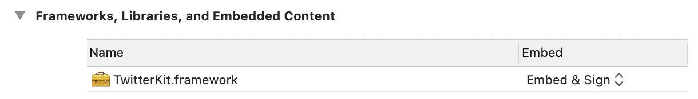

# 9.1 集成配置

1、请将R2TwitterFramework.framework、TwitterCore.framework、TwitterKit.framework、TwitterKitResources.bundle以copy items if needed方式拖进你的Xcode项目工程主目录，具体选择请参照“1.1添加R2SDKFramework.framework”。

2、在Xcode工程中，选择您的target后， 在General里的Frameworks,Libraries,and Embedded Content选项，将TwitterKit.framework设置为Embed &sign. 如图所示：



3、将TwitterCore.framework、TwitterKit.framework添加到工程设置的Linked Frameworks and Libraries.

4、配置项目Info.plist

请将Bunle目录中的info.plist文件，右键以"Open As Source Code”的方式打开，然后添加如下内容即可：

```objectivec

<key>CFBundleURLTypes</key>
<array>
  <dict>
    <key>CFBundleURLSchemes</key>
    <array>
      <string>twitterkit-<consumerKey></string>
    </array>
  </dict>
</array>
<key>LSApplicationQueriesSchemes</key>
<array>
    <string>twitter</string>
    <string>twitterauth</string>
</array>
```

其中尖括号内的consumerKey参数必须与Twitter后台的参数一致，如不详请咨询SDK客户端技术人员。

