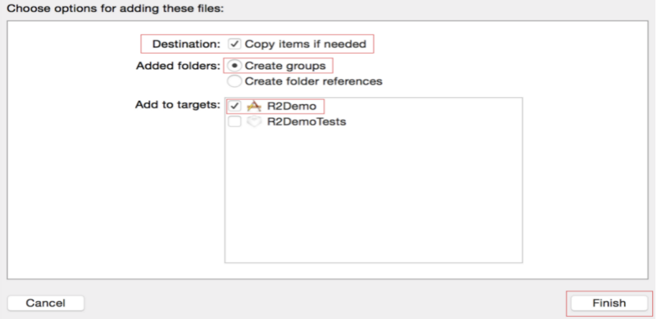
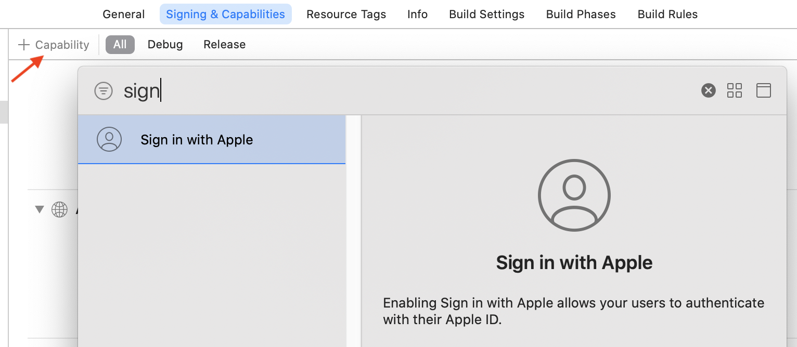
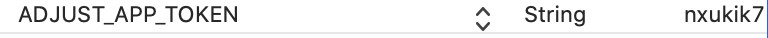

# 1.1 R2SDK集成配置

### 将 R2SDK添加至您的iOS项目 <a id="h2--r2sdk-ios-"></a>

### 前提条件 <a id="h2-u524Du63D0u6761u4EF6"></a>

* 安装以下应用： Xcode 11.0 或更高版本
* 确保您的项目满足以下要求： 您的项目必须针对 iOS 8 或更高版本。
* 设置一台 iOS 真机设备运行您的应用。

### 添加SDK <a id="h2--sdk"></a>

请将R2SDKFramework.framework、R2SDK.bundle添加到您的iOS项目中，在弹出的选择框中（如下图所示）：选中 “Copy items if needed”与 “Create groups”并选择被添加的target为你的应用工程。点击Finish完成Framework的添加。



### 集成配置 <a id="h2-u96C6u6210u914Du7F6E"></a>

1、请在项目的info.plist文件中增加如下字段。注意此处必须配置，否则无法成功集成R2SDK。请将info.plist 右键选择sourceCode方式打开，添加如下字段：如已添加则无需重复添加。

```text
 <key>R2GameID</key>
 <string>{Your game id}</string>
 <key>R2Platform</key>
 <string>appstore</string>
 <key>R2_NEW_GAME_FLAG</key>
 <string>200</string>
```

2、请确保工程增加了Sign in With Apple功能




3、如需使用R2SDK集成的打点服务，请增加如下配置（如果不需要集成R2 SDK打点服务，请忽略，R2SDK打点服务据点请在info.plist文件中增加如下内容：

```text
 <key>R2_TRACK_APPID</key>
 <string>{你的track app id,若不详请咨询SDK服务器端技术人员}</string>
 <key>R2_TRACK_SECRET_KEY</key>
 <string>{你的track secret key,若不详请咨询SDK服务器端技术人员}</string>
```


如需使用SDK打点集成的Adjust打点服务，请增加如下内容：


（1）增加**ADJUST\_APP\_TOKEN** 字段，具体配置如下



* key:必须为 
  **ADJUST\_APP\_TOKEN** 
* type:必须为 String 
* value:Adjust分配给游戏的参数（具体值若不详请咨询运营）

（2）增加**ADJUST\_SANDBOX**字段，具体配置如下


* key:必须为 
  **ADJUST\_SANDBOX**
* type:必须为 Boolean 
* value:YES 或者NO,用来指定是否沙盒环境


如需使用SDK打点集成的Firebase打点服务，请增加如下内容：


增加**R2\_FIREBASE\_TRACK**字段，具体配置如下


* key:必须为 
  **R2\_FIREBASE\_TRACK**
* type:必须为 Boolean 
* value:YES 或者NO,用来指定是否需要使用SDK集成的Firebase打点服务 

