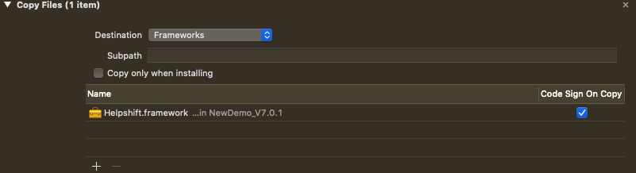
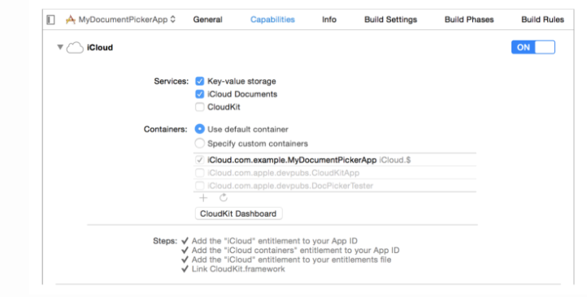

# 2.2 Helpshift集成配置

项目中若集成了Helpshift相关功能，则必须完成如下配置，否则忽视该章节。所有和Helpshift有关的文件都在helpshift-sdk-ios中。如有需要请参照Helpshift官方集成开发帮助网页：**https://developers.helpshift.com/ios/**

1**、**请将Helpshift.framework和HelpshiftCustomLocalizations**、**HelpshiftCustomThemes直接拖入（drag-drop）你应用的工程下。

2、
在xcode中，找到你项目的Info.plist，鼠标右键点击，然后选择 "Open As Source Code".在打开的界面中，添加如下隐私权限配置：

```objectivec
<key>NSPhotoLibraryUsageDescription</key>
<string> “We need to access photos library to allow users manually pick images meant to be sent as attachment for help and support reasons.</string>在你工程的Build Phases的Link Binary With Libraries里确保已链接Helpshift.framework。
```

3、在你工程的**Build Phases**的**Link Binary With Libraries**里确保已链接**Helpshift.framework**。

4、在Build Phases里添加Copy Files.示例如下：



5、在Build Phases里添加Run Script.请确保这部分在Copy Files的下方。否则会由于找不到文件路径报错。请将如下脚本指令复制粘贴到Run Script部分。

```text
bash "${BUILT_PRODUCTS_DIR}/${FRAMEWORKS_FOLDER_PATH}/Helpshift.framework/strip_frameworks.sh"
```

6、如果你的工程里没有任何swift代码,请在Build Settings下将Always Embed Swift Standard Libaries设置为YES。

7、V7.7.0及以后用户可以发送除照片外的文件如pdf,视频等。要访问iOS的“文件”应用程序中的文件，开发人员需要启用iCloud服务功能。具体设置如下：



