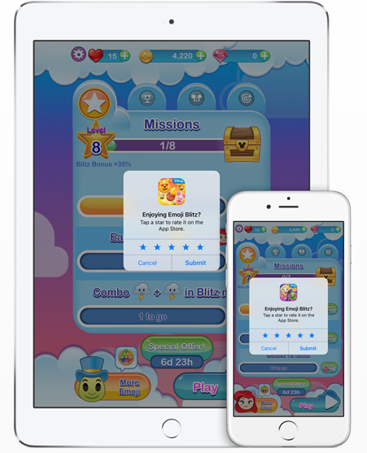

# 3.14 app store应用内评分

#### 功能说明：

 请在合适的时机调用该接口，请求玩家进行对你的APP进行评分。请在用户最可能对你的应用感到满意的情况下发起请求。比如在用户完成某个人物，等级得到提升后调用，确保不要中断他们的活动。应用场景如下图所示：



#### 接口形式：

```objectivec
-(void)requestRating;
```

#### 接口示例：

```objectivec
[[R2SDKMgrApi sharedInstance]requestRating];
```

