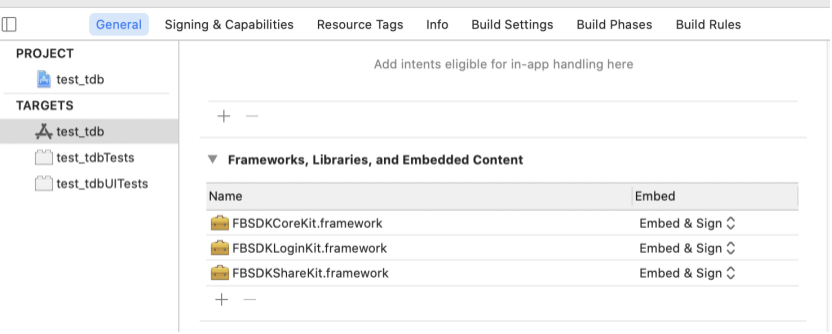

# 2.1 Facebook集成配置

**添加Framewrok**

使用R2 Facebook API 需要添加FBSDKCoreKit.framework,FBSDKLoginKit.framework,FBSDKShareKit.framework 和 R2FacebookFramework.framework.

  
FBSDKCoreKit,FBSDKLoginKit,FBSDKShareKit是动态库，需要选中target -&gt; General -&gt; Frameworks,Libraries,and Embedded Content选项中将其设为Embed&Sign，如图所示：



**配置项目Info.plist**

在xcode中，找到你项目的Info.plist，鼠标右键点击，然后选择 “Open As Source Code”.在打开的界面中，添加如下配置：

```objectivec
<key>CFBundleURLTypes</key>
<array>
<dict>
<key>CFBundleURLSchemes</key>
<array>
<string>fb{your-app-id}</string>
</array>
</dict>
</array>
<key>FacebookAppID</key>
<string>{your-app-id}</string>
<key>FacebookDisplayName</key>
<string>{your-app-name}</string>
<key>LSApplicationQueriesSchemes</key>
<array>
 <string>fbapi</string>
  <string>fbapi20130214</string>
  <string>fbapi20130410</string>
  <string>fbapi20130702</string>
  <string>fbapi20131010</string>
  <string>fbapi20131219</string>
  <string>fbapi20140410</string>
  <string>fbapi20140116</string>
  <string>fbapi20150313</string>
  <string>fbapi20150629</string>
  <string>fbapi20160328</string>
  <string>fbauth</string>
  <string>fb-messenger-share-api</string>
  <string>fbauth2</string>
  <string>fbshareextension</string>
  <string>fb</string>
</array>
<key>NSPhotoLibraryUsageDescription</key>
<string>{human-readable reason for photo access}</string>
```


注:请将{your-app-id}替换为你自身游戏对应的由Facebook开发者后台分配的APP ID. 将{Your App Name}替换为你应用在Facebook开发者后台上配置的Display Name.将{human-readable reason for photo access}替换为你需要访问相册的原因。如：This app requires access to the photo library.


**配置Build Settings**

1. 打开你的Xcode工程，在导航栏找到Build Settings选项。
2. 选择Other Linker Flags进行编辑。
3. 在Other Linker Flags选项中添加-ObjC标记。
4. 在你的Xcode项目的”Build Phases”的Link Binary with Libraries配置项下引入系统Accelerate.framework、libc + +.tbd。\(R2FacebookSDK v2.3.0后需新增该引用库\)


